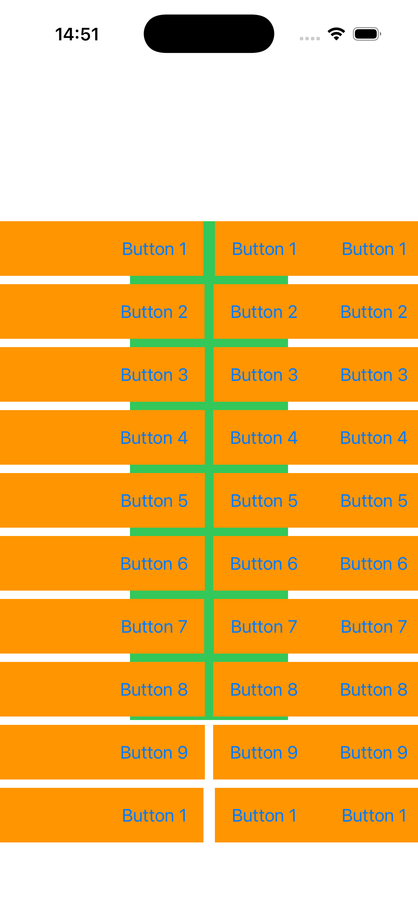

# FB18231015 - SwiftUI: Content outside of SafeAreaPadding not interactive

## Scenario

A SwiftUI app with a ScrollView that has a `.safeAreaInset()` and some of the content has `.ignoresSafeArea()` set. The content is filled with buttons which change color on interaction.

The content is displayed outside of the safe area as expected. When scrolling the content, it scrolls outside of the .vertical safe area and is still interactive. 

## Issue

The content outside of the .horizontal safe area (perpendicular to the scroll direction) is not interactive. 

	
## Example code

The example shows the described scenario.

  

## Tested on

	- Xcode Version 26.0 (17A5241e) on iOS 26.0 beta (23A5260k)
